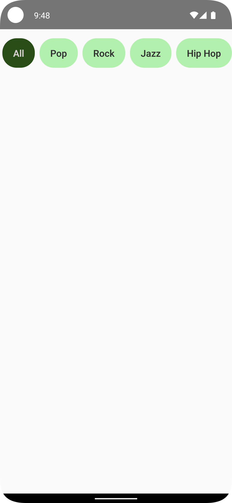

# LabelSelectorBarComposable

  

## Medium Article

This project is accompanied by a detailed Medium article titled "Basic Android Compose - Label Selector Bar." You can read the article [here](https://medium.com/@kenruizinoue/basic-android-compose-label-selector-bar-a757784384e3).

## Overview

`LabelSelectorBarComposable` is an Android UI built using Jetpack Compose. This project showcases the development of a `LabelSelectorBar()` composable.

Key features of the `LabelSelectorBarComposable` include:

- Dynamic selection management: Seamlessly handle user interactions and state changes.
- Flexible layout: Easily integrate into various UI designs and screen sizes.

## Getting Started

1. Clone the repository to your local machine.
2. Open the project in Android Studio (preferably the latest version for full Compose support).
3. Run the app on an emulator or physical device to see the app in action.